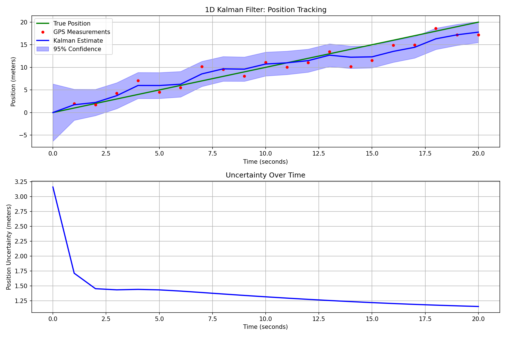
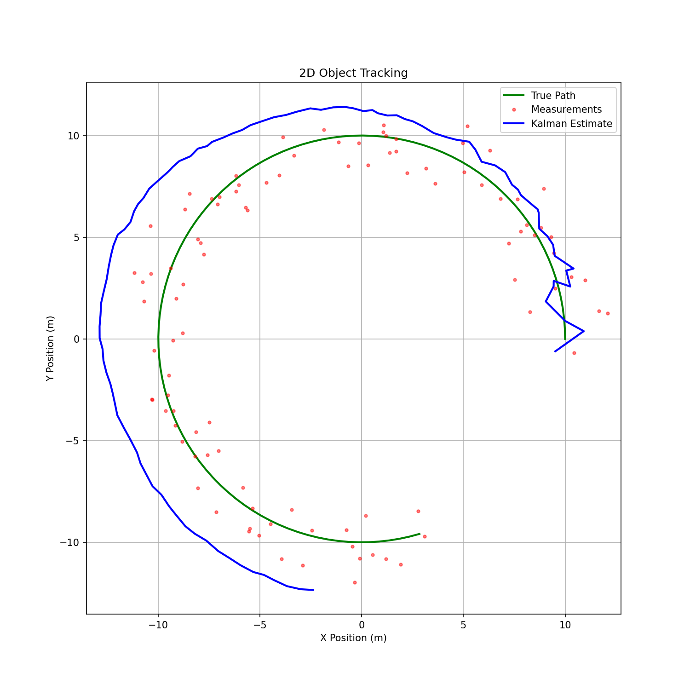
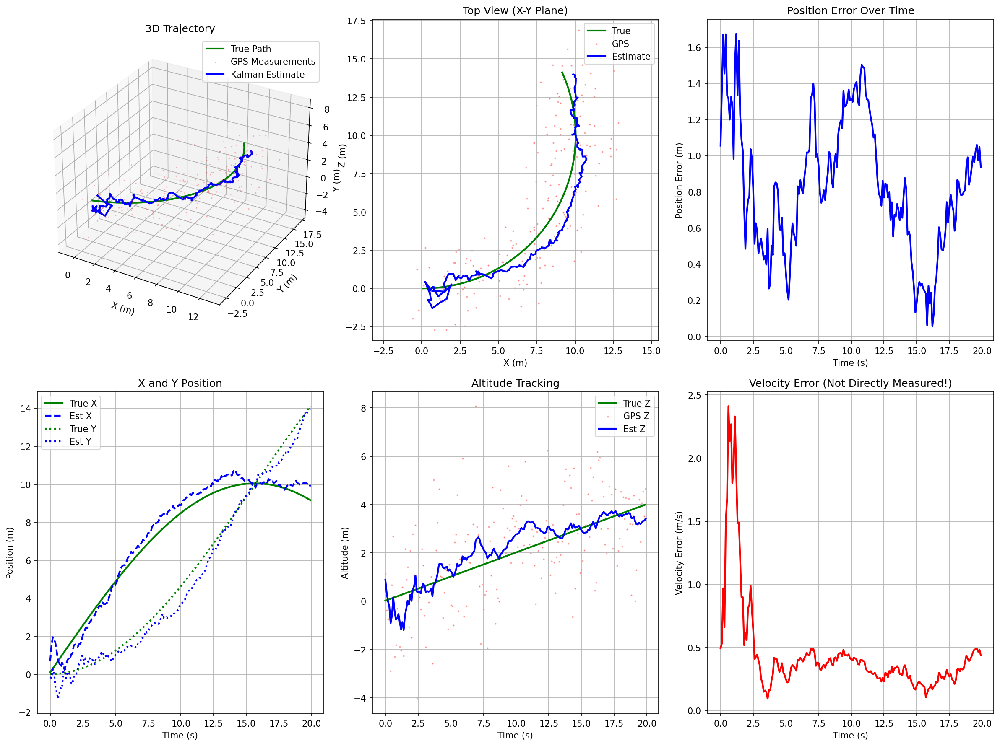

# 卡尔曼滤波学习系列

属于 [AI Hardware Engineer Roadmap](../../../../README.md) 的一部分。

## 学习路径

| 等级 | 章节 |
|-------|----------|
| **起点** | [00 - Index](00-index.md) |
| **小学** | [01](01-what-is-estimation.md) · [02](02-noisy-measurements.md) · [03](03-combining-information.md) |
| **初中** | [04](04-averages-and-uncertainty.md) · [05](05-weighted-averages.md) · [06](06-prediction.md) |
| **高中** | [07](07-kalman-filter-idea.md) · [08](08-1d-kalman-filter.md) · [09](09-tracking-moving-object.md) |
| **本科** | [10](10-matrix-form.md) · [11](11-multidimensional-kf.md) |

## 参考

- [Cheat Sheet](cheat-sheet.md)
- [传感器融合指南](../Guide.md)

## 示例输出





## 运行

```bash
pip install numpy matplotlib
python kalman_1d.py   # or kalman_2d.py, kalman_6d.py
```

## 外部链接

- [Kalman Filter (Wikipedia)](https://en.wikipedia.org/wiki/Kalman_filter)
- [Roger Labbe's Book](https://github.com/rlabbe/Kalman-and-Bayesian-Filters-in-Python)


<details>
<summary>English original</summary>

**Kalman Filter Learning Series**

Part of the [AI Hardware Engineer Roadmap](../../../../README.md).

**Learning Path**

| Level | Chapters |
|-------|----------|
| **Start** | [00 - Index](00-index.md) |
| **Elementary** | [01](01-what-is-estimation.md) · [02](02-noisy-measurements.md) · [03](03-combining-information.md) |
| **Middle School** | [04](04-averages-and-uncertainty.md) · [05](05-weighted-averages.md) · [06](06-prediction.md) |
| **High School** | [07](07-kalman-filter-idea.md) · [08](08-1d-kalman-filter.md) · [09](09-tracking-moving-object.md) |
| **Undergraduate** | [10](10-matrix-form.md) · [11](11-multidimensional-kf.md) |

**Reference**

- [Cheat Sheet](cheat-sheet.md)
- [Sensor Fusion Guide](../Guide.md)

**Example Outputs**


**Run**

```bash
pip install numpy matplotlib
python kalman_1d.py   # or kalman_2d.py, kalman_6d.py
```

**External**

- [Kalman Filter (Wikipedia)](https://en.wikipedia.org/wiki/Kalman_filter)
- [Roger Labbe's Book](https://github.com/rlabbe/Kalman-and-Bayesian-Filters-in-Python)

</details>

---

> 原文：[`Phase 3 - Artificial Intelligence/Track A - Hardware and Edge AI/4. Sensor Fusion/kalman-filter/README.md`](https://github.com/ai-hpc/ai-hardware-engineer-roadmap/blob/main/Phase%203%20-%20Artificial%20Intelligence/Track%20A%20-%20Hardware%20and%20Edge%20AI/4.%20Sensor%20Fusion/kalman-filter/README.md)（上游仓库 ai-hpc/ai-hardware-engineer-roadmap，MIT License）。本页为中文翻译，术语保留英文原词；与原文不一致时以原文为准。
